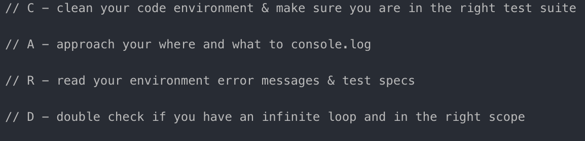
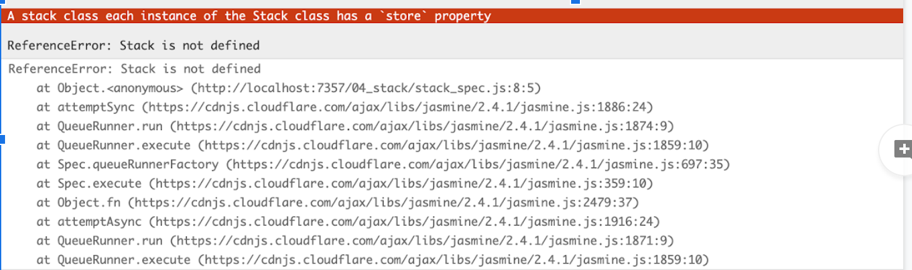
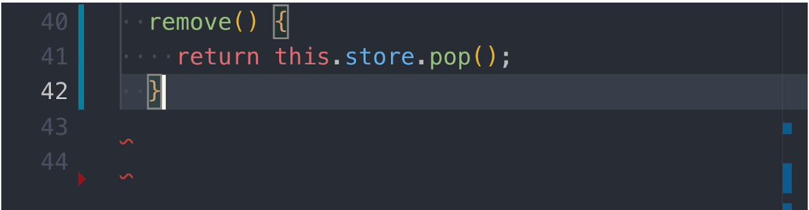
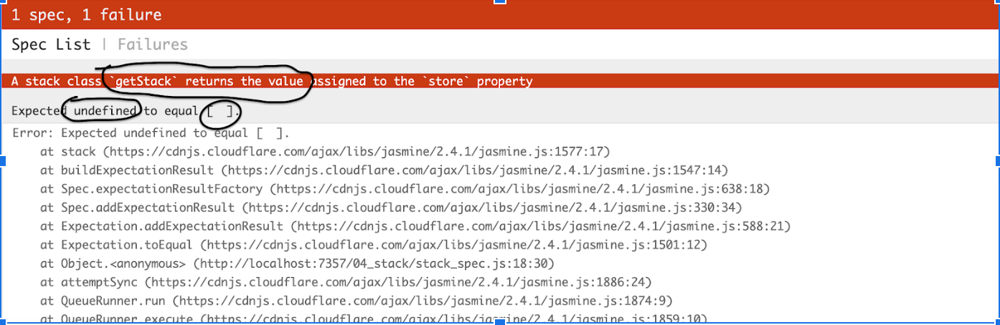
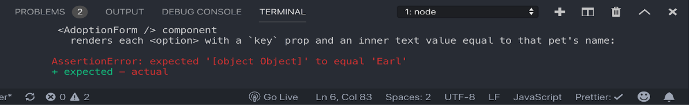
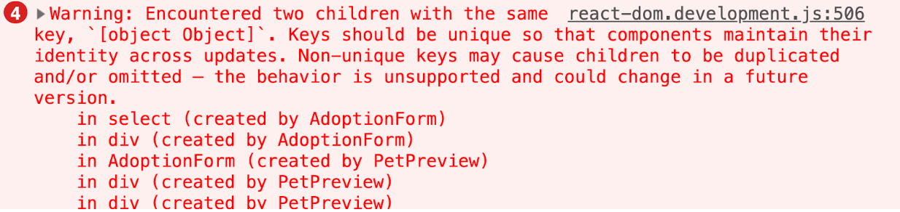
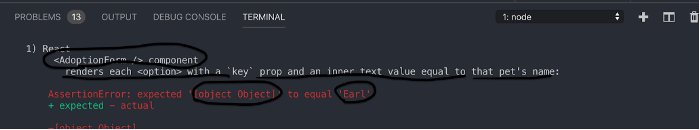
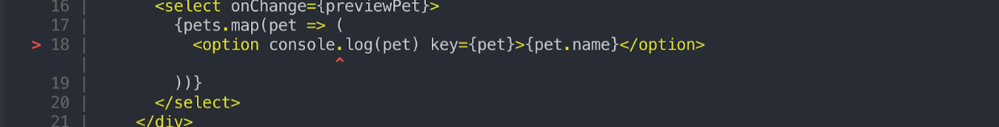

Did you card it?

This guide is written to give you a blueprint to follow, so you know exactly where, and what to console.log(). We will go over two examples one with test specs written in jasmine and vanilla js & another written in mocha enzyme and jsx.

I am also going to refer to the acronym -

// C - clean your code environment & make sure you are in the right test suite

// A - approach your where and what to console.log

// R - read your environment error messages & test specs

// D - double check if you have an infinite loop and in the right scope

So next time when you approach a unit test, you will know. did I CARD it? or CRAD it?

##Clean your code environment & make sure you are in the right test suite.

Only work with one set of test suites at a time.
Make sure you are looking at the right suite of test specs & click on the spec if you can, cd if there is a deeper directory and run test script, or pending other test specs manually works as well.
Make sure there are no major linting errors!
Always write with tidy code and see if you have any syntax or reference errors.

If you do not have a clean your environment, it does not matter how succinct your inner code base is, one missing curly bracket can mess up your entire workflow. So make sure you address this first!

Before anything make sure you have only ONE set of testing ware open each time.
Also I would click on the test spec if you can and make sure the test specs are HIGHLIGHTED.

If needed, cd into it, if the problem is in a deeper directory, or pend it manually by adding an ‘x’ in front of each unit test.

Here we have an example of an unclean code environment.

```js
25 class Stack {
26  constructor() {
27    this.store = []
28  }
29
30  getStack() {
31    return this.stoer
32  }
33
34  add(item) {
35    this.store.push(item);
36
37    return this
38  }
39
40  remove: () {
41    return this.store.pop()
42  }
43
```

If you look closely, you will notice the signals your developer tools and code editor are giving to you if you have a linter installed.



I noticed that I was missing a closing bracket because when I clicked on the last bracket on my class. It indicated to me that the closing bracket was on my remove method and not the closing bracket for my class.

Notice the transparent rectangles around my curly brackets. When they are both highlighted this indicates the opening and closing bracket of the bracket you clicked on, whether its opening or closing.



Hint: Click on the last bracket of your nested functions or objects, to see where the opening or closing brackets end for each bracket declaration. For nested brackets, I use Rainbow Brackets from VS code extensions for easy bracket distinctions through colors.

Make sure there are no major linting errors, or else you will not be able to console.log

##Approach your where & what to console.log()

When it comes down to console.log it breaks down to:

where - in what line of code and where in the line.

what - what variables are we using in our one console.log, how many, any primitives to attach…

Where - A lot of unit tests will give you hints if you read its final expected definition.

In this case it was faster to read the test specs first and try to debug to find out where the problem in my code was. However it is always on a case by case basis, so it is better to always read the test specs with developer tools opened and approach your where and what to console.log.



It says expected “undefined” to equal “[ ]”. Clearly our getStack method is returning undefined instead of an empty array.

I went back to my code and went to lines 30-32 of my getStack method and realized my I misspelled my this.store. I quickly fix it, without any needed console.log and get all my test specs to run.

```js
30 getStack() {
31  return this.store
32 }
```

##Read the developer settings error messages & test spec environment messages.

```js
09 // C - clean your code enviornment & make sure you are in the right test suite.
10 // A - approach your where and what to console.log
11 // R - read the developer setttings error messages & test specs.
12 // D - double check if you are in the right scope and enviornment.
13
14 return (
15  <div>
16    <button type="button onClick={adoptPet}> Adopt Me! </button>
17    <select onChange={petPreview}>{pets.map(pet => (<option key={pet}>{pet.name}
18    </option>
19    ))}
20   </select>
21  </div>
22 )

```


Picture A.

Picture B.

Sometimes your test spec messages and developer settings are useful in finding the error and you still need to find your what & where to console.log() anyways. For example in this mocha test spec for JSX.

From picture A. I notice my adoptionForm component is broken and specifically my option html jsx, key property is not rendering the key property with the pet’s name.


I go to my adoptionForm component, and go to line 18 where my option tag is being rendered by react.

What - what variables are we using in our one console.log, how many, any primitives to attach.

Based on early suggestion the render key prop is not rendering the right value, so why don’t we console.log(pet).

```js
16 <button type="button onClick={adoptPet}> Adopt Me! </button>
17  <select onChange={petPreview}>{pets.map(pet => (
18  <option console.log(pet) key={pet}>{pet.name}</option>
```

Do you see something wrong? I hit save and I get this scary error message in node.js



My terminal is telling me there is something wrong with line 18 and particularly the console.log as indicated by two red arrows. Also if you were to take a closer look at console.log() - the text changed into a white color with a red linting error under the console.

This brings us to our final acronym D - double check if you are in the right scope.

##Double check if you have an infinite loop and in the right scope.

This is often forgotten and so detrimental because sometimes we don’t see our console.log or even worse our entire testing suite crashes. This can simply be because of a poorly scoped and misplaced console.log() that is causing a parsing error or an infinite loop in our code.

In our case, this is a poorly scoped console.log() and you can tell because my linter is yelling at me with fat red lines under my console in console.log. Which brings us back to the point that you should always clean your code environment first.

I realized in jsx, you have to console.log() inside curly brackets and I move my console.log inside my key property and replace the logic inside with console.log and I attach a primitive string before it to easily label and keep track of my console.log().

```js
16 <button type="button onClick={adoptPet}> Adopt Me! </button>
17  <select onChange={petPreview}>{pets.map(pet => (
18  <option  key={console.log("pet: ", pet)}>{pet.name}</option>
```

I open up my developer tools and notice I am getting back an object instead of a name string.

I refactor my code to console.log pet’s name with a pet’s name string to indicate where I am in my code.

Long behold, I got what I wanted and I realized I was not dotting my pet object to extract the name, instead I was just rendering the entire pet object for the key, which is not unique.

I change the value of my key prop to pet.name instead of pet and I pass the test!

In conclusion, there are a countless ways to debug in test driven development, but to have a nice foundation, that I hope you will CARD it when the comes.
