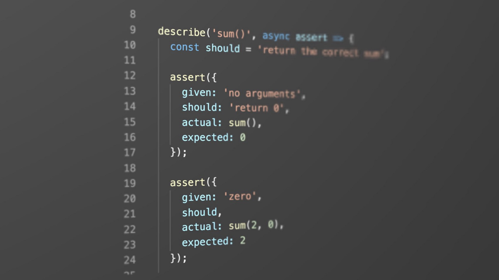
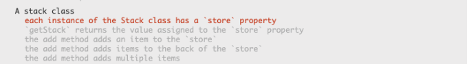
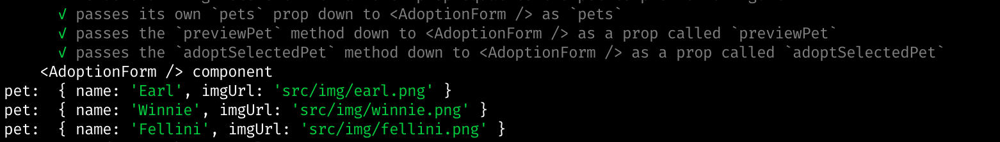

Hi, this brief guide is written to give you beginner friendly tips to follow, so you can avoid early mistakes in any testing environment.

_We will go over two examples:_

**1**. **Jasmine & vanilla JavaScript**

**2**. **Mocha Enzyme & React JSX**

##C - Clean your code environment & make sure you are in the right test suite.

**Isolate your unit test**:

Before anything make sure you have only **ONE** set of testing suite open each time.

Make sure you are looking at the right suite of test specs and click on the spec if you can, change into directory — if there is a deeper directory & run test script, pending other test specs manually works as well.

By doing so you are isolating your unit testing environment and all function calls will focus only on that block of code.



**Zero Linting Errors**:

Make sure there are no major linter errors and have a linter installed on your code editor! Otherwise, you will not be able to see any output in the console.

**Always write with tidy code and see if you have any syntax or reference errors.**

_Here we have an example of an unclean code environment._

```js
25 class Stack {
26  constructor() {
27    this.store = []
28  }
29
30  getStack() {
31    return this.stoer
32  }
33
34  add(item) {
35    this.store.push(item);
36
37    return this
38  }
39
40  remove: () {
41    return this.store.pop()
42  }
43
```

If you look closely, you will notice the signals your developer tools and code editor are giving to you if you have a linter installed.

Otherwise, the unit test is giving us a hint - apparently our stack class is not even defined.


_This brings our attention to the beginning and end of our function - lines 40-43 and 25-28_

After examining our code, I noticed that I was missing a closing bracket because when I clicked on the last bracket on our class.

It indicated to me that the closing bracket was on our remove method.


Hint: By clicking on the last bracket of your nested functions or objects you can see where the opening or closing brackets are for each function declaration. _For nested brackets, I use Rainbow Brackets from VS code extensions for easy bracket distinctions through colors._

##A - Approach your where & what to console.log()

**Where** - in what line of code and where in the line

A lot of unit tests will give you hints if you read its final **expected definition**.

It is failing the getStack() method for our stack class and not returning the value assigned from our store property.


In this case, the unit test was more clear to find our where.

**However it is always on a case by case basis, so it is better to always read the test specs with developer tools opened at the same time to approach your where and what to `console.log()`.**

It says expected “undefined” to equal “[ ]”. Clearly our `getStack()` method is returning `undefined` instead of an empty array.

This indicates lines _30–32_ of our `getStack()` method. I realized I misspelled `this.store` in our `constructor()`. I quickly make adjustments, without any needed `console.log()` and get all our test specs to run.

```js
30 getStack() {
31  return this.store
32 }
```

##R - Read the developer tools & testing environment error messages.

```js
01 import React from 'react'
02 // C - clean your code environment & make sure you are in the right test suite.
03 // A - approach your where and what to console.log
04 // R - read the developer tools & testing environment error messages.
05 // D - double check if you have any infinite logic and/or within the right scope
06
07 export default const AdoptionForm = (props) => {
08  const {pets, petPreview, adoptSelectedPet} = props
09
10  return (
11    <div>
12      <button type="button" onClick={adoptSelectedPet}> Adopt Me!</button>
13      <select onChange={petPreview}>{pets.map(pet => (<option key={pet}>{pet.name}
14      </option>))}
16      </select>
17    </div>
18  )
19 }

```


**_Picture A_-Node.js**


**_Picture B_-Developer Tools**

Know your testing environments and read your developer tool's messages!

For example in this Mocha test spec for JSX, we have to check our Node.js environment for expected outputs, since Mocha primarily runs in a Node.js environment.

From picture A. I notice our adoptionForm component is broken and specifically our option html JSX key property is not rendering the key property with the pet's name.

From picture B. I know that we are outputting two children with the same key and keys have to be unique since we are mapping an array inside a React component.

I go to our adoptionForm component, and go to line _13_ where our option tag is being rendered by React.

**What** - what variables are we using in our `console.log()`

When debugging sometimes it is smarter to target our bigger data sets and chip away.

By looking at the big picture you can ensure a wider range of data consistency and catch any reference errors earlier while saving yourself a step in the process.

Since we know our pets array is being mapped into each pet object, why don't we console.log our (pet ) object to see what we are outputting, at the same time this enables us to see what keys and values are inside this pet object.

```js
16 <button type="button onClick={adoptPet}> Adopt Me! </button>
17  <select onChange={petPreview}>{pets.map(pet => (
18  <option console.log(pet) key={pet}>{pet.name}</option>
```

_Do you see something wrong? I hit save and I get this scary error message in Node.js_


*Do you see something wrong? I hit save and I get this scary error message in Node.js.*

*Our testing environment is telling us there is something wrong with console.log(pet) as indicated by two red arrows.*

This brings us to our final acronym D.

##D - Double check if you have any infinite logic and/or within the right scope

This is often forgotten and so detrimental because sometimes we don’t see our outputs or even worse our laptop overloads due to overflow logic.

**This can simply be because of a poorly scoped and misplaced console.log() that is causing a parsing error or an infinite loop in our code.**

In our case, this is a poorly scoped `console.log()`.

In JSX, you have to console.log() within each JSX element's scope and this means inside the curly brackets.

Therefore, we have to move our console.log() inside our key property's scope or "curly brackets" in JavaScript.

We replace our logic inside with a pet string comma delimited with a pet variable so we can easily label our console.log() in our console.

```js
16 <button type="button onClick={adoptPet}> Adopt Me!</button>
17  <select onChange={petPreview}>{pets.map(pet => (
18  <option  key={console.log("pet: ", pet)}>{pet.name}</option>
```

*I check my node environment for expected outputs and notice we are getting back an object with a name key.*



*I refactor our code to dot of our pet object with a comma delimited pet's name string.*

```js
16 <button type="button onClick={adoptPet}> Adopt Me! </button>
17  <select onChange={petPreview}>{pets.map(pet => (
18  <option  key={console.log("pet's name: ", pet.name)}>{pet.name}</option>
```

Long behold, I got what I wanted and I realized I was not accessing the value of my key property in our pet object to extract the name, instead I was just rendering the entire pet object as a value for the key, which is not unique.

I change the value of our key prop to `pet.name` instead of `pet` and I pass the test.

**In conclusion**, there are countless ways to debug in test driven development but having the proper environment and knowing your do's and don'ts in test driven development can really make or break your hours or days. I hope this

Until next time. I hope you will CARD it when the comes. Happy Coding! - RL
