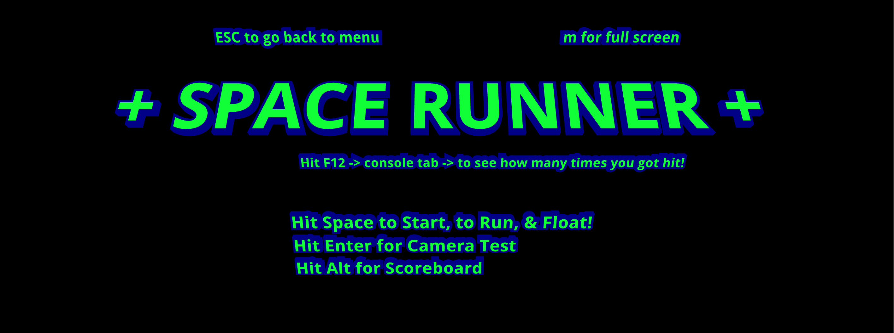
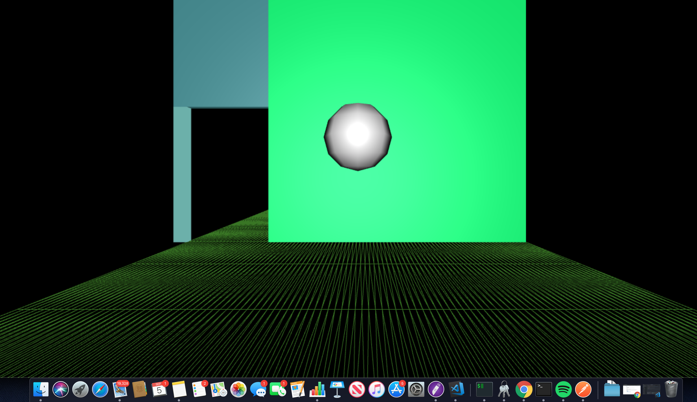

Github: [https://github.com/space-runner-prototype/space-runner](https://github.com/space-runner-prototype/space-runner)

FIRST PERSON ENDLESS RUNNER prototype w/ webcam motion capture Machine Learning.

## To Run Application

1. git clone https://github.com/space-runner-prototype/space-runner.git in terminal
2. cd space-runner
3. npm i
4. npm run build
5. copy path of the index html onto your browser
6. enjoy!

## Tech Stack

three.js
ml5.js
tenserflow
poseNet()
