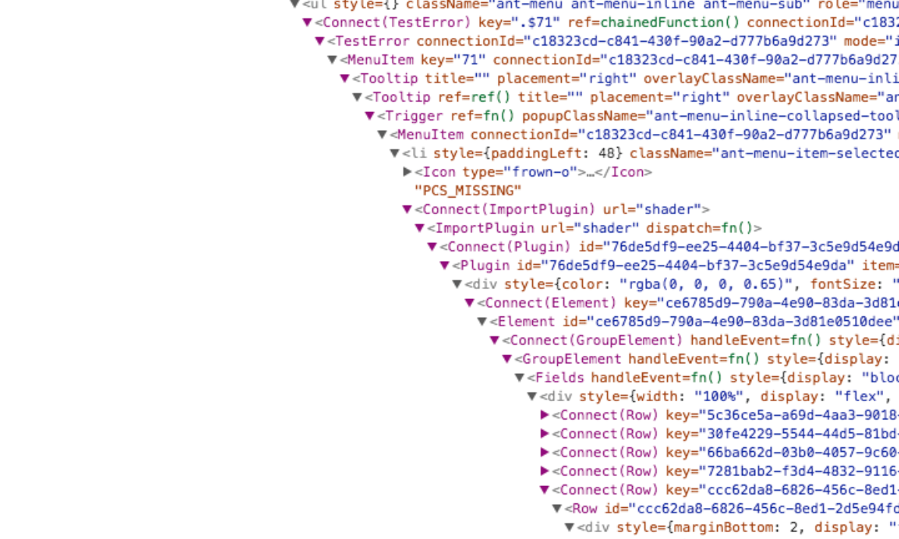
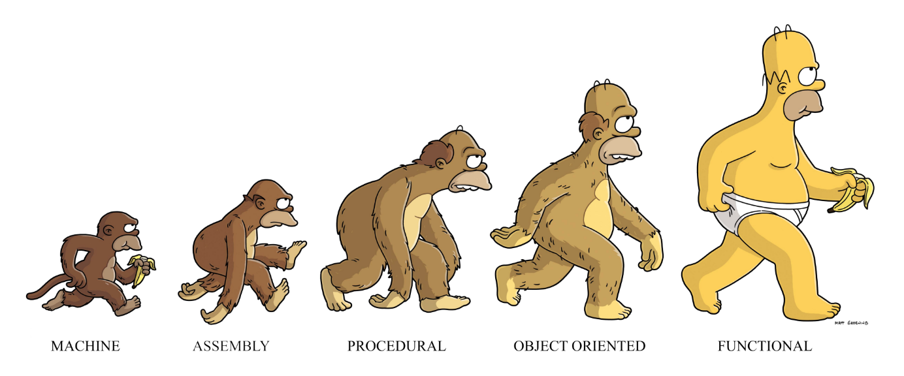

Since React is so popular among modern developers today, this blog is intended to give you the pros and cons of react hooks vs classes through React 16.8's release of **`useState()`** and **`useEffect()`**'s hooks api.

<h3 align="center">How does React work?</h3>


<p align="center">React is a JavaScript framework used to build user interfaces. One of the main benefits of React is its ability to maintain productivity and reusability in scale with its JSX syntax extension allowing for easier writing and processing of components.</p>

In React, **components** are simply html elements written in JSX with added logic, conditions, functionality, and side effects returned in either a function or a class.

With React, you can build **_single page applications_** also known as SPA with neat features like React Router.

**_Need to go mobile?_** No problem - there’s React Native, without having to sacrifice the brain power of learning a completely new language or framework, you can jump straight into mobile development with a foundational knowledge of React.js.

**_Having performance issues or slow render times?_** React introduces the virtual DOM, where it compares new data with the original DOM and automatically updates the view.

These are just some of the benefits that come with React, along with its growing community and influx of libraries for issues such as **global state management**, **styled components**, **testing**, **AR/VR**, **_service workers_** and the list goes on.

We will first go over what **hooks** and **classes** are in React, and how the release of hooks in **React 16.8** solved the three pain points classes had:

**1**. **reusing logic between multiple components** can lead to _wrapper hell_ or deeply nested components.



**2**. **unrelated mixed in logic** in life cycle methods can get repetitive, and cause unnecessary _side effects_.

**3**. lastly classes are simply **not optimal for compilers**.

_Facebook uses a component folding library called Prepack, and they found that class components can encourage unintentional patterns that make optimizations fall back to a slower path._ - [Introducing Hooks section. - reactjs](https://reactjs.org/docs/hooks-intro.html)

**THE PROBLEM**: React doesn’t provide a stateful primitive simpler than a class component - _Dan Abramov, React.js conf._

## Managing Local State:

<h4 align="center">What is a class in React?</h4>

Class components come from ES6 classes and were the default method for managing local state, it also allowed for side effects to occur through lifecycle methods.

_Here is a simple example of a counter with an increment button written in a class._

```
import React from 'react'

class Counter extends React.Component {
  constructor() {
    super()
    this.state = {
      counter: 0
    }
    this.handleIncrement = this.handleIncrement.bind(this)
  }

  handleIncrement() {
    this.setState({
      counter: this.state.counter += 1
    })
  }

  render() {
    return (
      <div>
        <div>{this.state.counter}</div>
        <hr />
        <button type="button" onClick={this.handleIncrement}>+</button>
     </div>
    )
  }
}
```

As you can see, this requires you having to set up the constructor and a super, as well as additional wrappers such as the `render()` function. Not to mention, you have to bind the context of _this_ in the `constructor()`.

<h4 align="center">What is a React Hook?</h4>


<p align="center">Hooks allow you to use local state and other React features without writing a class.</p>

There are **two rules** of hooks:

**1.** _Only call hooks at the top level, do not nest your hooks in any logic._

**2.** _Only call Hooks from React functions or custom hooks._

**Note:** Hooks are completely on an opt-in basis and 100% backwards-compatible. This means you don’t have to learn or use hooks right away and there will be no breaking changes when adding or refactoring your classes.

This is the same example but written without a class and instead with hooks.

```
import React, {useState} from 'react'

function Counter() {
  const [counter, incrementCounter] = useState(0)

  function handleIncrement() {
    incrementCounter(counter + 1)
  }

  return (
    <div>
      <div>{counter}</div>
      <hr />
      <button type="button" onClick={handleIncrement}>+</button>
    </div>
  )
}
```

By importing and calling `useState()` it declares a “state variable”. In this case, our variable is called `count`.

`useState()` only takes one argument and that is the initial state, the state does not have to be an object.

`useState()` returns a pair of values, the current state and a function that updates it.

By destructuring our array into two variables, we can use a more declarative approach by closely grouping the two values whom which uses the state and affects the state.

Therefore our current state is the value of `count` and our `incrementCounter` is the function that updates `count`.

Notice how each variable correlates with its respective value, and functions stay DRY and reusable. There is no need for the context of this anymore and I saved some finger strength and time.

## Introducing Side Effects:


<h4 align="center">What is a side effect?</h4>

A side effect is generally anything that affects something outside the scope of the function being executed, or in the context of React - anything that modifies some state outside of its local environment.

Common side effects include data fetching, setting up subscriptions, and manually changing the DOM in React components.

In the case of React, there are two common cases of side effects which include that those that don’t and those that do require cleanup.

Examples of effects without cleanup are network requests, manual DOM mutations, and logging. This is because we run them and immediately forget about them.

**Class Example** w/ DOM mutations:

```
import React from 'react'

class Counter extends React.Component {
  constructor() {
    super()
    this.state = {
    	counter: 0
    }
    this.handleIncrement = this.handleIncrement.bind(this)
  }

  componentDidMount() {
    document.title = this.state.counter;
  }

  componentDidUpdate() {
    document.title = this.state.counter;
  }

  handleIncrement() {
    this.setState({
      counter: this.state.counter += 1
    })
  }

  render() {
    return (
      <div>
        <div>{this.state.counter}</div>
        <hr />
        <button type="button" onClick={this.handleIncrement}>+</button>
     </div>
    )
  }
}
```

This is an example of a side effect being introduced through React’s lifecycle methods found in
Classes. E.g. `componentDidMount()`, `componentDidUpdate()`, `componentWillUnMount()`

In this example, the `componentDidMount()` “mounts” or sets up the title of the document to be the current count of the local state.

The `componentDidUpdate()` is invoked as soon as the updating happens, the most common use case for `componentDidUpdate()` is updating the DOM in response to a prop or state change.

If we wanted to reset the count, we would also need a componentWillUnMount().

**Hooks Example:**

_During our 3 week capstone at Fullstack Academy of Code we utilized functional components with hooks using `useEffect()` to fetch NYC OPEN DATA and remote custom databases in arcGIS. Here is our [Github: VisualNYC](https://github.com/1904cs-charlie-owl/VisualNYC) and our [features](https://rickylau.dev/visualnyc/)._

_Here is an example with the **`useEffect()`** hook:_

```
import React, {useState} from 'react'

function Counter() {
  const [counter, incrementCounter] = useState(0)

  useEffect(() => {
    document.title = counter
  })

  function handleIncrement() {
    incrementCounter(counter + 1)
  }

  return (
    <div>
      <div>{counter}</div>
      <hr />
      <button type="button" onClick={handleIncrement}>+</button>
    </div>
  )
}
```

`useEffect()` tells your component to do something after every render.

React will remember the callback being passed in, and call it after the DOM updates.

`useEffect()` is placed inside our function component because we want to have access to our local state count.

Additionally `useEffect()` runs after every render, therefore it is like a `componentDidMount()`, `componentDidUpdate()`, and `componentWillUnMount()` all in one.

**Optimizing Performance by Skipping Effects**

Cleaning up and applying the effect after every render is task heavy and we might right run into issues or bugs.

In **class** components, we can combat this by adding an extra conditional into our componentDidUpdate function and passing in prevProps and prevState as parameters.

If for instance, we wanted to limit our title to be a maximum count of 10.

**Class Example**:

```
import React from 'react'

class Counter extends React.Component {
  constructor() {
    super()
    this.state = {
    	counter: 0
    }
    this.handleIncrement = this.handleIncrement.bind(this)
  }

  componentDidMount() {
    document.title = this.state.counter;
  }

  componentDidUpdate(prevProps, prevState) {
    if (prevState.counter <= 10) {
    document.title = this.state.counter;
    }
  }

  handleIncrement() {
    this.setState({
      counter: this.state.counter += 1
    })
  }

  render() {
    return (
      <div>
        <div>{this.state.counter}</div>
        <hr />
        <button type="button" onClick={this.handleIncrement}>+</button>
     </div>
    )
  }
}
```

In **hooks**, we can simply pass a second argument into `useEffect()` as an array with count in it and add the conditional inside our `useEffect()`. Whatever is being passed into the array can be used to define all variables on which the hook depends. If one of the variables updates, the hook runs again.

**Important**: If you pass an empty array, the hook doesn’t run when updating the component at all because their is nothing to watch for. This is useful when you are fetching data in a loop, and you only want to fetch it on `componentDidMount()`, therefore stopping the loop.

**Hooks Example:**

```
import React, {useState} from 'react'

function Counter() {
  const [counter, incrementCounter] = useState(0)

  useEffect(() => {
    if (counter <= 10) {
      document.title = counter
    }
  }, [counter])

  function handleIncrement() {
    incrementCounter(counter + 1)
  }

  return (
    <div>
      <div>{counter}</div>
      <hr />
      <button type="button" onClick={handleIncrement}>+</button>
    </div>
  )
}
```

If you are interested in learning more about hooks like accessing context api, etc. - [link to context api](https://reactjs.org/docs/hooks-reference.html#usecontext)

**In conclusion**, hooks solved many of the pain points that classes had:

**1**. difficulty in reusing logic between multiple components

**2**. giant components - too many lifecycle methods, and unrelated & repetitive code

**3**. Not human and machine friendly in some cases



_[So You Want to be a Functional Programmer - Charles Scalfani](https://medium.com/@cscalfani/so-you-want-to-be-a-functional-programmer-part-1-1f15e387e536)_

Hooks also adapts the benefits of functional reusability to React.

But in the end, there are still many use cases for classes and they are still loved and adored by many in React for alot of reasons.

_For example, if you wanted to break down your side effects into specific life cycle methods or if you needed a small piece component level state._

This blog guide was **not meant** to sway you into using hooks or completely refactoring your classes to hooks.

I would stay away from big application refactoring, and if hooks really do interest you, try to apply the concepts to new projects you will be working on instead.

This has been my personal preference & experience with hooks and classes in React, and I hope you left a little bit wittier about React.

Until next time. **Happy Coding!** - _RL_
