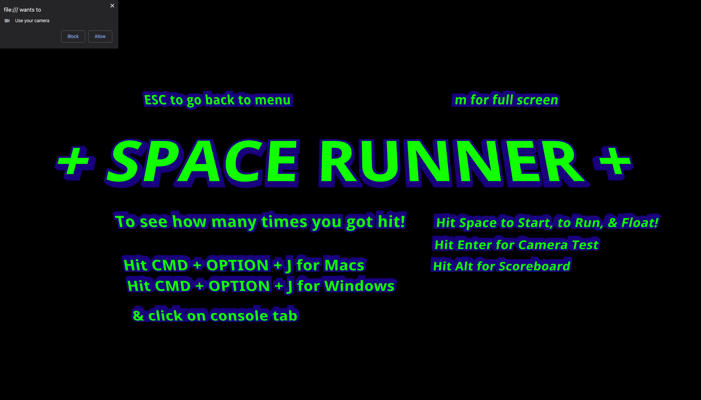
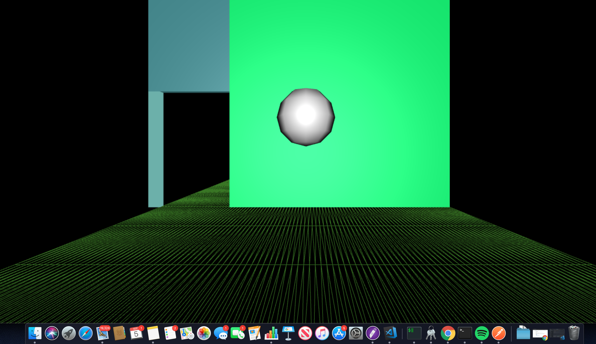

**Github**: [https://github.com/space-runner-prototype/space-runner](https://github.com/space-runner-prototype/space-runner)

FIRST PERSON ENDLESS RUNNER prototype w/ webcam motion capture Machine Learning.

Project was done as a two person team in a 4 day hackathon sprint. Technologies used to generate 3D images was three.js and browser side motion capture using ml5.js PoseNet.

## To Run Application

1. git clone https://github.com/space-runner-prototype/space-runner.git in terminal
2. cd space-runner
3. npm i
4. npm run build
5. copy path of the index html onto your browser
6. enjoy!

## Tech Stack

three.js
ml5.js
tenserflow
poseNet()

## Dev Team

- Ricky Lau ([LinkedIn](https://www.linkedin.com/in/rickylaudev) | [GitHub](https://github.com/rickylaufitness))
- Alexander Mok ([LinkedIn](https://www.linkedin.com/in/mok-alexander/) | [GitHub](https://github.com/MistuhMok))
