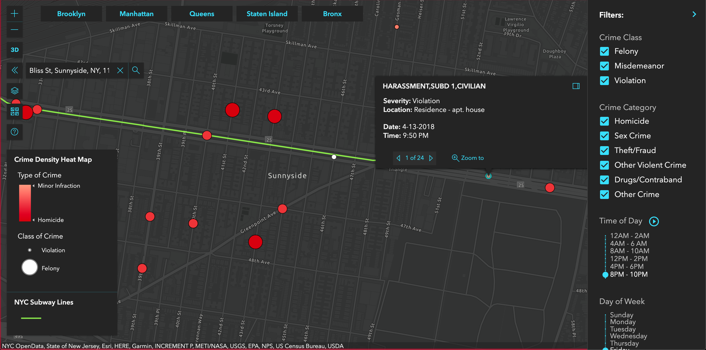
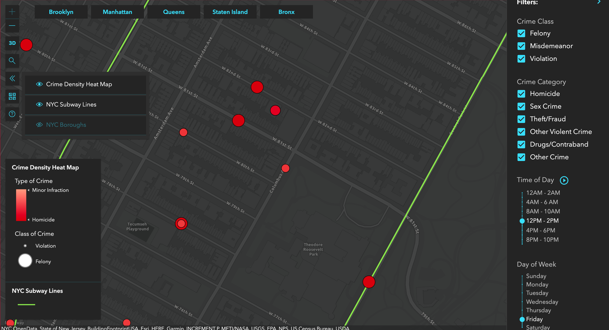
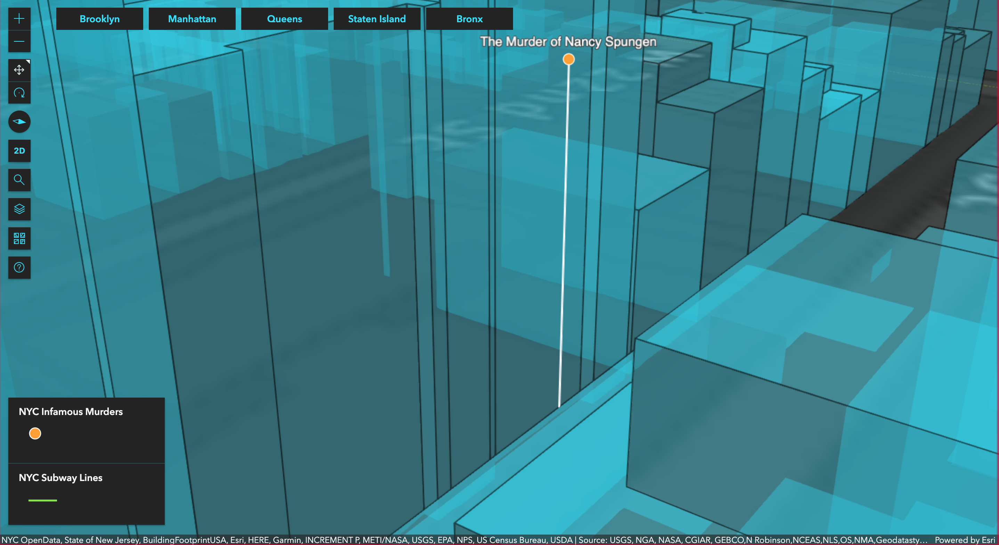

Interactive map of New York City featuring data visualizations of 2018 crime statistics based on NYC open data.

---

---

**Link**: [visualnyc.net](http://www.visualnyc.net/)

**Capstone Presentation**: [https://youtu.be/wW63u2Y1gsk](https://youtu.be/wW63u2Y1gsk)

**Github**: [https://github.com/1904cs-charlie-owl/VisualNYC](https://github.com/1904cs-charlie-owl/VisualNYC)

<h2 align="center">Description</h2>

---

_VisualNYC grab's user's current day and time and automatically filters into a two hour window from your current time._

---

**Filter**: Highlighted borough buttons on top left allow for easy switch in borough view. Default view is Manhattan.

Map can be adjusted to display only crimes by: **1**. time of day, **2**. day of the week, **3**. class of crime, **4**. category of crime etc.

---

**Search**: Need to find a specific place, restaurant, or meet up spot? use search feature to to pinpoint your location in any borough in Greater NYC Area.

---

**Zoom**: As you zoom in the heatmap will continue to render to show you crime density based on your location and crime filter settings.

---

**View**: Once zoomed in enough, visualNYC will transform the user's view into a pin point map with color and radius indicators based on the type of crime and class of crime.

User can click on a pinpoint to see specific crime related details such as severity, location, date and time of crime occurence.

**Play Feature**: By clicking the blue play button next to Time of Day, user can see an automatic progression of crime data over time in both heat map view and pinpoint view.

---

_**Don't like a specfic layer or view?**_ Filter through your layers, and choose your best eye candy.

---

### Future Endeavors - 3D data visualization with custom csv, json, geojson files.

---

Data is based off of NYC historical crime from beginning of 2018 until end of 2018.

This project will help users decide if their security is at risk when moving to or visiting a location and answer the age old question, is this area safe to be in?

_Example:_

1. Is it safe to walk in a neighborhood at 1am?
2. Do I want to move to this neighborhood?
3. Should I get an Uber or walk to the closest subway stop?
4. Is this neighborhood safe to let my kid's go trick or treating?

## Tech Stack

ArcGIS
React.js
redux.js
Node.js
Travis
Git
GitHub
Heroku

## Dev Team

- Ricky Lau ([LinkedIn](https://www.linkedin.com/in/rickylaudev) | [GitHub](https://github.com/rickylaufitness))
- Michael Siciliano ([LinkedIn](https://www.linkedin.com/in/michael-siciliano-1904/) | [GitHub](https://github.com/msicil))
- Justin Kichler ([LinkedIn](https://www.linkedin.com/in/justinkichler/) | [GitHub](https://github.com/jkichler))
- Alexander Mann ([LinkedIn](https://www.linkedin.com/in/alexandermann2015/) | [GitHub](https://github.com/AlexanderMann2015))
