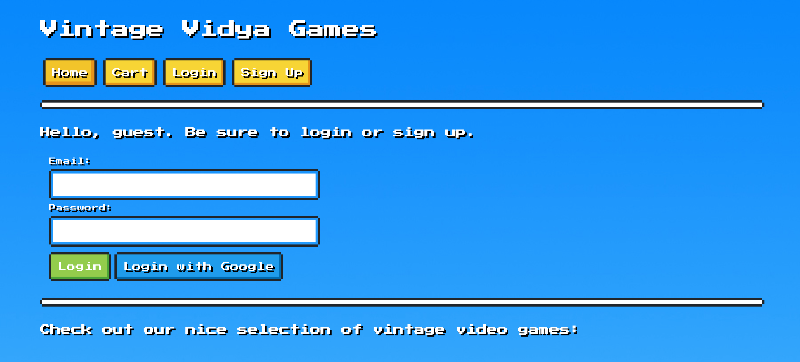
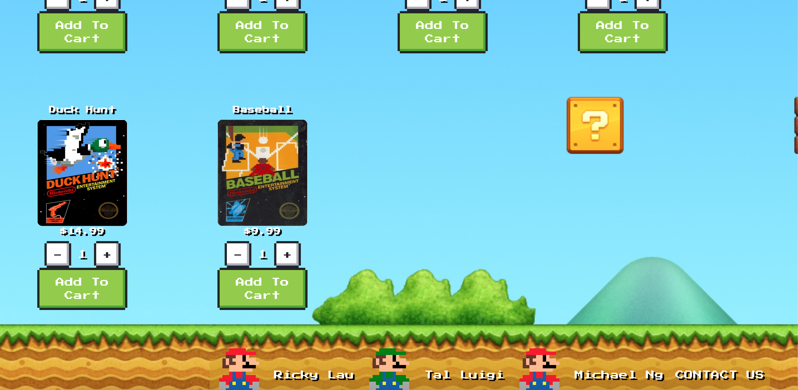

Vintage Vidya Games is an NES themed e-commerce web app complete with graphics and sound, that offers old-school video games for sale.

Link: [https://vintage-vidya-games.herokuapp.com/](https://vintage-vidya-games.herokuapp.com/)

Github: [https://github.com/fiesty-fish/vintageesportsllc](https://github.com/fiesty-fish/vintageesportsllc)

Video Presentation: Coming soon..

## Tech Stack

The app was built using Node.js, Express.js, Sequelize.js, and PostgreSQL on the backend, React.js, Redux.js, and NES.css on the frontend, and utilizes the Stripe API. It was completed using Agile methodologies in 10 days for a group project and uses a restful api.

## Dev Team:

- Ricky Lau ([LinkedIn](https://www.linkedin.com/in/rickylaudev) | [GitHub](https://github.com/rickylaufitness))
- Tal Luigi ([LinkedIn](https://www.linkedin.com/in/talluigi) | [GitHub](https://github.com/luigilegion))
- Michael Ng ([LinkedIn](https://www.linkedin.com/in/michael-m-ng) | [GitHub](https://github.com/xmng))
